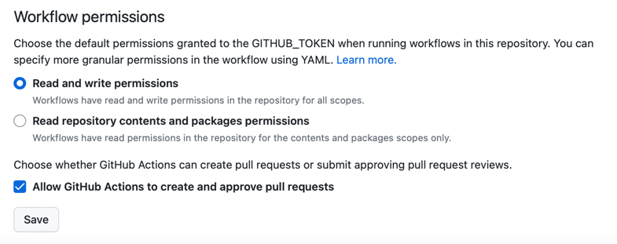
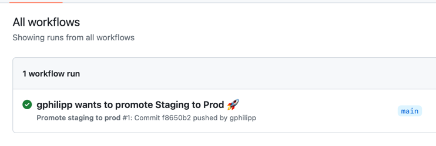
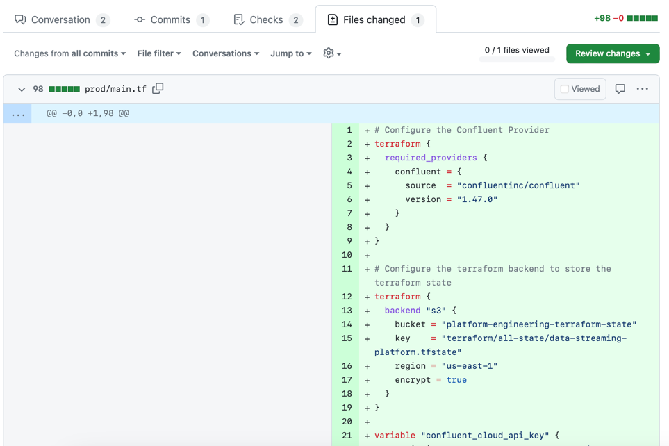
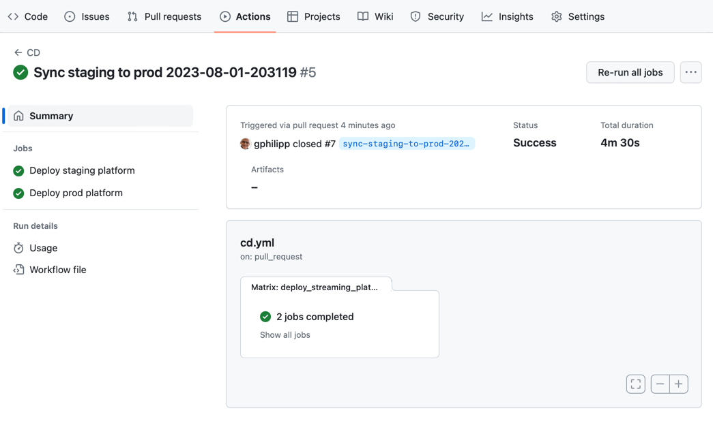
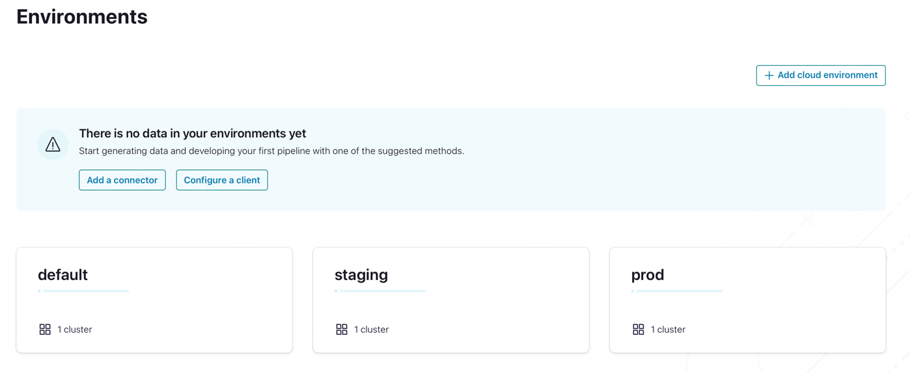

## Instructions

We're going to build a pipeline to create both a staging and a production Confluent Cloud data streaming platform.

In a true GitOps fashion, instead of using the Web UI or the CLI to do so, we're going to use Terraform and GitHub actions to build a CI/CD pipeline and automate the deployment.

You will need a Confluent Cloud account, a GitHub account, and an AWS account to store the Terraform state (though you can adapt the terraform code to use a different backend)

First, create a directory for this exercise.
```shell
mkdir data-streaming-platform-pipeline && cd data-streaming-platform-pipeline
```

We need a Confluent Cloud API key which will be used by Terraform to create and update all  Confluent Cloud resources programmatically.

We're going to create this API key via the Confluent Cloud CLI, you can install it with `brew install confluentinc/tap/cli` or follow the instructions here.

If you prefer, you can also use the Confluent Cloud UI and head over to "Cloud API Keys" in the Administration section. Just make sure to select "Granular access" to create the service account.

Let's create the service account with the CLI:
```shell
confluent iam service-account create terraform_runner --description "Service Account used by Terraform to create and update Confluent Cloud resources"
```

This is the output you should get:
```
+-------------+--------------------------------+
| ID          | sa-56q6kz                      |
| Name        | terraform_runner               |
| Description | Service Account used by        |
|             | Terraform to create and update |
|             | Confluent Cloud resources      |
+-------------+--------------------------------+
```

We also must grant this account the `OrganizationAdmin` role, just use the service account id you've just created above in the command below:
```shell
confluent iam rbac role-binding create --principal User:sa-56q6kz --role OrganizationAdmin
```

Let's create an API key, again, use the service account id you've created:
``` shell
confluent api-key --service-account sa-56q6kz create --resource cloud --description "Confluent Cloud API key for terraform_runner service account"
```

You should get something along those lines (note that I've deleted that key long before publishing this exercise).
```
It may take a couple of minutes for the API key to be ready.
Save the API key and secret. The secret is not retrievable later.
+------------+------------------------------------------------------------------+
| API Key    | DIK7CITBPM5L6KC6                                                 |
| API Secret | RV+GNsKQT6xLjI82wo1ItakGzFeTNwYUzBVKaWvOME+Hh4vdO2ZZp98r6HDzkfmh |
+------------+------------------------------------------------------------------+
```

Great, we have an API key that we can now use to run Terraform from within the CI/CD pipeline. Keep it in a safe place, we're going to use in the next steps.

Now, create a subdirectory called `staging`
```shell
mkdir staging && cd staging
```
In this directory, create a `main.tf` file with the following content:

```terraform
# Configure the Confluent Provider
terraform {
  required_providers {
    confluent = {
      source  = "confluentinc/confluent"
      version = "1.47.0"
    }
  }
}

# Configure the terraform backend to store the terraform state
terraform {
  backend "s3" {
    bucket = "platform-engineering-terraform-state"
    key    = "terraform/all-state/data-streaming-platform.tfstate"
    region = "us-east-1"
    encrypt = true
  }
}

variable "confluent_cloud_api_key" {
  description = "Confluent Cloud API Key (also referred as Cloud API ID)"
  type        = string
  sensitive = "true"
}

variable "confluent_cloud_api_secret" {
  description = "Confluent Cloud API Secret"
  type        = string
  sensitive = "true"
}

variable "confluent_cloud_environment_name" {
  default = "unnamed"
}

provider "confluent" {
  cloud_api_key       = var.confluent_cloud_api_key
  cloud_api_secret    = var.confluent_cloud_api_secret
}

resource "confluent_environment" "env" {
  display_name = var.confluent_cloud_environment_name
}

resource "confluent_kafka_cluster" "standard" {
  display_name = "standard_kafka_cluster"
  availability = "SINGLE_ZONE"
  cloud        = "AWS"
  region       = "us-east-2"
  standard {}

  environment {
    id = confluent_environment.env.id
  }
}

# We use a dedicated service account, called 'platform-manager', per environment
resource "confluent_service_account" "platform-manager" {
  display_name = "platform-manager-${confluent_environment.env.display_name}"
  description  = "Service account to manage the platform"
}

# The 'platform-manager' account is a cloud cluster admin.
resource "confluent_role_binding" "platform-manager-kafka-cluster-admin" {
  principal   = "User:${confluent_service_account.platform-manager.id}"
  role_name   = "CloudClusterAdmin"
  crn_pattern = confluent_kafka_cluster.standard.rbac_crn
}

resource "confluent_api_key" "platform-manager-kafka-api-key" {
  display_name = "platform-manager-kafka-api-key"
  description  = "Kafka API Key that is owned by 'platform-manager' service account"
  owner {
    id          = confluent_service_account.platform-manager.id
    api_version = confluent_service_account.platform-manager.api_version
    kind        = confluent_service_account.platform-manager.kind
  }

  managed_resource {
    id          = confluent_kafka_cluster.standard.id
    api_version = confluent_kafka_cluster.standard.api_version
    kind        = confluent_kafka_cluster.standard.kind

    environment {
      id = confluent_environment.env.id
    }
  }

  # The goal is to ensure that confluent_role_binding.app-manager-kafka-cluster-admin is created before
  # confluent_api_key.app-manager-kafka-api-key is used to create instances of
  # confluent_kafka_topic, confluent_kafka_acl resources.
  # 'depends_on' meta-argument is specified to avoid having multiple copies of this definition in the configuration
  # which would happen if we specify it in confluent_kafka_topic, confluent_kafka_acl resources instead.
  depends_on = [
    confluent_role_binding.platform-manager-kafka-cluster-admin
  ]
}
```


If we wanted to, we could install Terraform locally and run the Terraform code from there, but that's exactly what we want to avoid when doing GitOps. Instead, we want a visible, repeatable, audited mechanism to deploy our data streaming platform. It's time for automation!

First, create a `.github/workflows` directory in your repository.
    ```shell
    cd .. && mkdir -p .github/workflows && cd .github/workflows 
    ```
In this `.github/workflows` directory, we're going to create 3 GitHub Actions workflow files: `ci.yml`, `cd.yml` and `promote.yaml`

The `ci.yml` contains the CI workflow which will be run when you open or update a pull request. It runs a lint job and prints the terraform plan in a PR comment:

```yaml
name: CI

on:
  pull_request:
    types:
      - opened
      - synchronize
    paths-ignore:
      - '**/README.md'

env:
  # We're using AWS S3 as the Terraform backend
  AWS_ACCESS_KEY_ID: ${{ secrets.AWS_ACCESS_KEY_ID }}
  AWS_SECRET_ACCESS_KEY: ${{ secrets.AWS_SECRET_ACCESS_KEY }}
  TF_BUCKET_STATE: ${{ vars.TF_BUCKET_STATE }}

  # Credentials for Confluent Cloud
  TF_VAR_CONFLUENT_CLOUD_API_KEY: ${{ secrets.TF_VAR_CONFLUENT_CLOUD_API_KEY }}
  TF_VAR_CONFLUENT_CLOUD_API_SECRET: ${{ secrets.TF_VAR_CONFLUENT_CLOUD_API_SECRET }}

  # Tell Terraform it's running in CI/CD
  TF_IN_AUTOMATION: true

jobs:
  lint:
    runs-on: ubuntu-latest
    steps:
      - uses: actions/checkout@v3
        name: Checkout source code

      - uses: actions/cache@v3
        name: Cache plugin dir
        with:
          path: ~/.tflint.d/plugins
          key: tflint-${{ hashFiles('.tflint.hcl') }}

      - uses: terraform-linters/setup-tflint@v3
        name: Setup TFLint
        with:
          tflint_version: v0.44.1

      - name: Show version
        run: tflint --version

      - name: Init TFLint
        run: tflint --init
        env:
          GITHUB_TOKEN: ${{ github.token }}

      - name: Run TFLint
        run: tflint -f compact

  terraform_plan:
    needs: [lint]
    name: "Terraform Plan"
    runs-on: ubuntu-latest
    defaults:
      run:
        shell: bash
        working-directory: ./staging
    steps:
      - name: Checkout the repository to the runner
        uses: actions/checkout@v3

      - name: Setup Terraform with specified version on the runner
        uses: hashicorp/setup-terraform@v2
        with:
          terraform_version: 1.3.0

      - name: Terraform init
        id: init
        run: terraform init -backend-config="bucket=$TF_BUCKET_STATE"

      - name: Terraform validate
        id: validate
        run: terraform validate

      - name: Terraform plan
        id: plan
        run: terraform plan -no-color -input=false -var="confluent_cloud_api_key=$TF_VAR_CONFLUENT_CLOUD_API_KEY" -var="confluent_cloud_api_secret=$TF_VAR_CONFLUENT_CLOUD_API_SECRET"
        continue-on-error: true

      - uses: actions/github-script@v6
        env:
          PLAN: "terraform\n${{ steps.plan.outputs.stdout }}"
        with:
          script: |
            const output = `#### Terraform Format and Style 🖌
            #### Environment ${{ matrix.environment }} (CI)
            #### Terraform Initialization ⚙️\`${{ steps.init.outcome }}\`
            #### Terraform Validation 🤖\`${{ steps.validate.outcome }}\`
            #### Terraform Plan 📖\`${{ steps.plan.outcome }}\`
            
            <details><summary>Show Plan</summary>
            
            \`\`\`\n
            ${process.env.PLAN}
            \`\`\`
            
            </details>
            *Pushed by: @${{ github.actor }}, Action: \`${{ github.event_name }}\`*`;
            
            github.rest.issues.createComment({
              issue_number: context.issue.number,
              owner: context.repo.owner,
              repo: context.repo.repo,
              body: output
            })

      - name: Terraform Plan Status
        if: steps.plan.outcome == 'failure'
        run: exit 1
```

Next, copy the following GitHub Action workflow in a `cd.yml` file.
This file contains the CD workflow which will run when you merge a pull request. It applies the terraform plan to all environments.  
```yaml
name: CD

on:
  pull_request:
    types:
      - closed
    paths-ignore:
      - '**/README.md'

env:
  # We're using AWS S3 as the Terraform backend
  AWS_ACCESS_KEY_ID: ${{ secrets.AWS_ACCESS_KEY_ID }}
  AWS_SECRET_ACCESS_KEY: ${{ secrets.AWS_SECRET_ACCESS_KEY }}
  TF_BUCKET_STATE: ${{ vars.TF_BUCKET_STATE }}

  # Credentials for Confluent Cloud
  TF_VAR_CONFLUENT_CLOUD_API_KEY: ${{ secrets.TF_VAR_CONFLUENT_CLOUD_API_KEY }}
  TF_VAR_CONFLUENT_CLOUD_API_SECRET: ${{ secrets.TF_VAR_CONFLUENT_CLOUD_API_SECRET }}

  # Tell Terraform it's running in CI/CD
  TF_IN_AUTOMATION: true

jobs:
  deploy_streaming_platform:
    name: "Deploy ${{ matrix.environment }} platform"
    if: github.event.pull_request.merged
    strategy:
      max-parallel: 1
      matrix:
        environment: [ staging, prod ]
    runs-on: ubuntu-latest
    steps:
      - name: Checkout the repository to the runner
        uses: actions/checkout@v3

      - name: Check terraform files existence
        id: check_files
        uses: andstor/file-existence-action@v2
        with:
          files: "${{ matrix.environment }}/*.tf"
          fail: true

      - name: Setup Terraform with specified version on the runner
        uses: hashicorp/setup-terraform@v2
        with:
          terraform_version: 1.5.4

      - name: Terraform init
        id: init
        run: terraform init -input=false -backend-config="bucket=$TF_BUCKET_STATE"
        working-directory: ${{ matrix.environment }}

      - name: Terraform validate
        id: validate
        run: terraform validate
        working-directory: ${{ matrix.environment }}

      - name: Terraform workspace
        id: workspace
        run: terraform workspace select -or-create ${{ matrix.environment }}
        working-directory: ${{ matrix.environment }}

      - name: Terraform plan
        id: plan
        run: terraform plan -no-color -input=false
          -var="confluent_cloud_api_key=$TF_VAR_CONFLUENT_CLOUD_API_KEY"
          -var="confluent_cloud_api_secret=$TF_VAR_CONFLUENT_CLOUD_API_SECRET"
          -var="confluent_cloud_environment_name=${{ matrix.environment }}"
        continue-on-error: true
        working-directory: ${{ matrix.environment }}

      - uses: actions/github-script@v6
        env:
          PLAN: "terraform\n${{ steps.plan.outputs.stdout }}"
        with:
          script: |
            const output = `#### Terraform Format and Style 🖌
            #### Environment ${{ matrix.environment }} (CD)
            #### Terraform Initialization ⚙️\`${{ steps.init.outcome }}\`
            #### Terraform Validation 🤖\`${{ steps.validate.outcome }}\`
            #### Terraform Plan 📖\`${{ steps.plan.outcome }}\`

            <details><summary>Show Plan</summary>

            \`\`\`\n
            ${process.env.PLAN}
            \`\`\`

            </details>
            *Pushed by: @${{ github.actor }}, Action: \`${{ github.event_name }}\`*`;

            github.rest.issues.createComment({
              issue_number: context.issue.number,
              owner: context.repo.owner,
              repo: context.repo.repo,
              body: output
            })

      - name: Terraform Apply
        if: github.ref == 'main' && github.event.pull_request.merged
        run: terraform apply -auto-approve -input=false
          -var="confluent_cloud_api_key=$TF_VAR_CONFLUENT_CLOUD_API_KEY"
          -var="confluent_cloud_api_secret=$TF_VAR_CONFLUENT_CLOUD_API_SECRET"
          -var="confluent_cloud_environment_name=${{ matrix.environment }}"
        working-directory: ${{ matrix.environment }}
```

Finally, here's the `promote.yml` file below. This workflow copies the content of the `staging` folder to the `prod` folder and runs whenever code is pushed to the `main` branch. We assume that you'll only make pull requests with changes in the `staging` folder or in the `prod/specific` folder.

```yaml
name: Promote staging to prod
run-name: ${{ github.actor }} wants to promote Staging to Prod 🚀
on:
  push:
    branches:
      - main
    paths-ignore:
      - '**/README.md'

jobs:
  promote:
    runs-on: ubuntu-latest
    steps:
      - name: Checkout code
        uses: actions/checkout@v3

      - run: echo "🔎 Compare and sync directories"
      - name: Compare and sync directories
        run: |
          # Exclude the 'specific' directory and compare staging and prod
          DIFF=$(rsync --stats --recursive --dry-run --exclude=specific ./staging/ ./prod/ | awk '/files transferred/{print $NF}')

          # If DIFF is not 0, means there are differences
          if [ "$DIFF" -ne 0 ]; then
            # If there are differences, use rsync to copy files excluding the 'specific' directory
            rsync --checksum --recursive --exclude=specific ./staging/ ./prod/
          fi

      - name: Set current date as env variable
        run: echo "NOW=$(date +'%Y-%m-%d-%H%M%S')" >> $GITHUB_ENV

      - name: Create Pull Request
        uses: peter-evans/create-pull-request@v5
        with:
          token: ${{ secrets.GITHUB_TOKEN }}
          commit-message: Sync staging to prod
          title: "Sync staging to prod ${{env.NOW}}"
          body: This PR is to sync the staging directory to the prod directory.
          branch: "sync-staging-to-prod-${{env.NOW}}"
```

We also need to create a `specific` subdirectory in each environment folder if we need environment specific code which will escape the copying from `staging` to `prod` done by the `promote` action.
```
cd ../..
mkdir -p staging/specific && touch staging/specific/.gitkeep 
mkdir -p prod/specific && touch prod/specific/.gitkeep
```

The last file we need is an AWS policy to grant read/write access to the S3 bucket which will store the Terraform State. We'll use it later when we do the initial setup.

Create the following  `s3_bucket_full_access_policy.json` at the top of your repository directory:
```json
{
  "Version": "2012-10-17",
  "Statement": [
    {
      "Effect": "Allow",
      "Action": "s3:*",
      "Resource": [
        "arn:aws:s3:::platform-engineering-terraform-state",
        "arn:aws:s3:::platform-engineering-terraform-state/*"
      ]
    }
  ]
}
```

Now, commit and push your changes (change `your_user` with your own username)
```shell
git init
git add .github staging prod *.json
```

If you run `git status` this is what you should get:
```shell
On branch main

No commits yet

Changes to be committed:
  (use "git rm --cached <file>..." to unstage)
	new file:   .github/workflows/cd.yml
	new file:   .github/workflows/ci.yml
	new file:   .github/workflows/promote.yml
	new file:   prod/specific/.gitkeep
	new file:   s3_bucket_full_access_policy.json
	new file:   staging/main.tf
	new file:   staging/specific/.gitkeep
```

Before committing and pushing those changes, we must allow GitHub Actions to create pull requests. Under the "Actions -> General -> Workflow Permissions" settings of your freshly created GitHub repository:
1. enable the "Allow GitHub Actions to create and approve pull requests" option 
2. allow `GITHUB_TOKEN` to read and write to your repository.
3. click the `Save` button.



With these two options enabled, our `promote` workflow will be able to create pull requests.

Run the following aws CLI commands to create the S3 bucket to store the state:
```shell
aws s3api create-bucket --bucket "platform-engineering-terraform-state"

aws iam create-user --user-name "terraform-user"

aws iam create-policy --policy-name S3FullAccessPolicy --policy-document file://s3_bucket_full_access_policy.json
# arn:aws:iam::321751332100:policy/S3FullAccessPolicy

aws iam attach-user-policy --policy-arn arn:aws:iam::321751332100:policy/S3FullAccessPolicy --user-name terraform-user
```

Add the following entries in your GitHub repo settings, under "Secrets and Variables > Actions":
- Add a repository variable called `TF_BUCKET_STATE` set to `platform-engineering-terraform-state`.
- Add repository secrets `AWS_ACCESS_KEY_ID` and `AWS_SECRET_ACCESS_KEY` set your AWS account API key (use a dedicated IAM user, not your root account)
- Add repository secrets `TF_VAR_CONFLUENT_CLOUD_API_KEY` and `TF_VAR_CONFLUENT_CLOUD_API_SECRET` set to the API credentials created earlier for your `terraform-user`.

Now, let's commit and push this code to GitHub.
```shell
git checkout -b automation
git commit -m "Automate the platform creation"
git remote add origin git@github.com:your_user/data-streaming-platform-pipeline.git
git push -u origin automation
```

Once you push, you should see the promote workflow being run in the "Actions" tab on GitHub.


In the "Pull Requests" tab, you can see that a PR has been created because we pushed directly to the `main` branch. Of course, you can prevent people from pushing directly to the `main` branch if you feel this is a bit risky. If you open this PR, you can see that the only change is the addition of the `main.tf` file under the `prod` folder.



When you merge that promotion PR, the CD workflow will trigger a job to terraform all the environments:



If you head over to Confluent Cloud, you can see that both environments have been created.


## Improvement Ideas

1. Remove duplication between `ci.yml` and `cd.yml`
2. `set-output` has been deprecated, so we need to update the steps which runs the plan and then prints it in a PR comment. 
3. Create an additional Disaster Recovery environment (in a `dr` folder) with Cluster Linking configured in `prod/specific`
4. Put the `platform-manager-kafka-api-key` in use.
5. Detect changes in folders to skip the unchanged environment deployment tasks early.
    ``` yaml
     - name: Get changed folder  
        id: getchange  
        run: |  
          echo "folder=$(git diff --dirstat=files,0 HEAD~1..HEAD | awk '{print $2}')" >> $GITHUB_OUTPUT  
      
    - name: CD into changed folder  
     run: cd ${{ steps.getchange.outputs.folder }}
     
    ```
6. Create topics and/or deploy Stream Governance
7. Maybe take advantage of the GitHub environments secrets. Not sure what it would improve though as we don't have env specific secrets, unless we update the GitHub actions to use env-specific credentials, but that would entail additional manual bootstrapping.

## Principles
- Infrastructure-related objects that cross service ownership borders like AWS VPCs are usually owned by the SRE team where they are grouped under workspaces with descriptive names (aws-infra) [(source)](https://medium.com/forto-tech-blog/gitops-nirvana-controlled-and-safe-promotions-of-changes-across-environments-with-terraform-6ec31d39b034)
- Every change is peer-reviewed.
- The files in the main branch always reflect the state of the cloud API.
- The user interacts with files and Git(and GitHub). No tooling, no tokens, no extra UI.
- Don't have a monorepo which spans all teams (*In the future, we plan to move the service-owned workspaces to their respective code repo*)
- Use separate folders to have control over the timing of promotion to each environment (e.g. Production)
- Don't use branches for managing different environments to
- Don't use environment conditionals in your TF code (*while it’s tempting to just use those mechanisms for referencing multiple environments in a single code directory, control over the timing of a change in each environment was not something we wanted to forsake*)
- Use a CI/CD pipeline, don't apply from your machine (*It forces peer review, ensures tool version parity, and significantly reduces toil on every change and initial workstation setup.*)
- On every PR open and update, we check Terraform formatting and generate a plan, we display the plan output as a comment in the PR and save the plan file to s3 to use when the PR is merged.
- Use small workspaces to reduce the chance of having stale, non-applied plans
- Merging to the main branch is the approval
- Engineers interact directly only with the staging folder.

## Resources
- https://developer.hashicorp.com/terraform/tutorials/automation/github-actions
- [Output Terraform Plan information into a merge request](https://gist.github.com/eana/83817cc9c911dd5230bfd3a108df4580) 
- https://spacelift.io/blog/github-actions-terraform
- https://docs.gitlab.com/ee/user/infrastructure/iac/
- https://docs.gitlab.com/ee/user/infrastructure/iac/terraform_state.html
- https://www.cloudthat.com/resources/blog/automate-terraform-modules-with-github-actions-as-infrastructure/
- https://www.pluralsight.com/resources/blog/cloud/how-to-use-github-actions-to-automate-terraform
- [Running Kubernetes on GitHub Actions](https://dev.to/kitarp29/running-kubernetes-on-github-actions-f2c)
- https://medium.com/forto-tech-blog/gitops-nirvana-controlled-and-safe-promotions-of-changes-across-environments-with-terraform-6ec31d39b034


